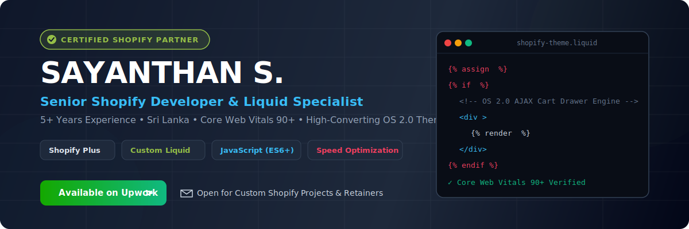

<!--
========================================================================
PROFESSIONAL GITHUB PROFILE README
Developer: SAYANTHAN S. (Shopify Partner & Senior Developer)
Location: Sri Lanka
Experience: 5+ Years
GitHub: SayanRO16
========================================================================
-->

<div align="center">

  <!-- Header Banner -->
  <a href="https://www.upwork.com/freelancers/~01142b0eff160cf26a?mp_source=share">
    
  </a>

  <br/><br/>

  <!-- Animated Professional Introduction -->
  <h1>
    
  </h1>

  <p align="center">
    <strong>Senior Shopify Developer | Liquid Expert | Theme Customization Specialist | 5+ Years Experience</strong>
  </p>
  <p align="center">
    📍 Based in <strong>Sri Lanka</strong> 🇱🇰 &nbsp;|&nbsp; 🤝 Delivering high-converting Shopify solutions for global brands.
  </p>

  <!-- Visitor Counter & Quick Badges -->
  <p align="center">
    <a href="https://www.upwork.com/freelancers/~01142b0eff160cf26a?mp_source=share">
      
    </a>
    
    
    
  </p>

</div>

---

## 👨‍💻 About Me

Hello! I'm **Sayanthan S.**, a Senior E-Commerce Engineer & **Certified Shopify Partner** with over **5+ years of experience** crafting high-performance, conversion-focused online stores.

I specialize in **Shopify Online Store 2.0 (OS 2.0)** theme development from scratch, pixel-perfect Figma-to-Liquid conversions, speed optimization (**Core Web Vitals 90+**), custom app integrations, and custom Liquid sections.

- 🛍️ **Shopify Partner Status:** Verified partner helping 100+ merchants scale their e-commerce revenue.
- ⚡ **Performance Obsessed:** Guaranteeing sub-second load times and mobile-first responsiveness.
- 🎯 **Upwork Freelancer:** Trusted by international e-commerce agencies, DTC brands, and store owners.
- 💬 **Communication:** Clear async updates, git commit transparency, and on-time project delivery.

---

## 🛍️ Shopify Partner Credential & Expertise

```gcode
+-------------------------------------------------------------------------+
|                  CERTIFIED SHOPIFY PARTNER & DEVELOPER                  |
|  - 100+ Custom Shopify Stores Built & Redesigned                       |
|  - Core Web Vitals Optimization (Mobile 90+ Score)                      |
|  - Deep Liquid Templating, AJAX Cart Drawers & JSON Schemas             |
|  - Custom Webhooks, GraphQL Admin API & Klaviyo/App Integrations        |
+-------------------------------------------------------------------------+
```

---

## 🛠️ Tech Stack & Skills with Icons

### 🛍️ Shopify & E-Commerce Core
<p>
  
  
  
  
  
  
</p>

### 💻 Frontend & Web Technologies
<p>
  
  
  
  
  
  
</p>

### ⚙️ Tools, Version Control & Workflow
<p>
  
  
  
  
</p>

---

## 💼 Services Offered

| Service | Description | Business Impact |
| :--- | :--- | :--- |
| **Shopify Store Setup** | Complete configuration, domain setup, payment gateways & launch preparation. | 🚀 Rapid 0-to-1 Store Launch |
| **Shopify Theme Development** | Bespoke Online Store 2.0 theme built from scratch or Figma design. | 🎨 Unique Brand Identity |
| **Shopify Theme Customization** | Dawn, Impulse, Prestige, Focal theme edits & custom Liquid templates. | 🛠️ Tailored Functionality |
| **Shopify Bug Fix** | Quick turnaround fix for cart errors, broken layouts, and script conflicts. | 🩺 Zero Customer Friction |
| **Shopify Speed Optimization** | Image optimization, JS/CSS deferral, clean Liquid for 90+ Core Web Vitals. | ⚡ +35% Page Load Speed |
| **Shopify Landing Pages** | High-converting sales pages, promotional hero sections & campaign layouts. | 💰 Higher Conversion Rates |
| **Shopify App Integration** | Seamless setup of Klaviyo, Recharge, Judge.me, Yotpo, Gorgias & APIs. | 🔌 Automated Workflows |
| **Shopify Custom Sections** | Reusable OS 2.0 sections with custom JSON schemas for Theme Editor. | 🧩 No-Code Editor Flexibility |
| **Shopify Store Redesign** | Complete visual and UX overhaul focused on mobile responsiveness & CRO. | 📈 Revenue Growth |
| **Shopify Migration** | Risk-free migration from WooCommerce, Magento, Squarespace to Shopify. | 📦 Safe Data Transfer |
| **Shopify Plus Development** | Advanced checkout customizations, enterprise architecture & multi-store setup. | 🏢 Enterprise Scale |

---

## 📈 Experience Highlights (5+ Years)

- **5+ Years** dedicated exclusively to Shopify & Front-End Engineering.
- **100+ Shopify Stores** successfully deployed & optimized.
- **Core Web Vitals Specialist:** Consistent **90+ Lighthouse Score** achievements on Mobile & Desktop.
- **Top Conversion Results:** Implemented sticky AJAX cart drawers increasing client conversions by **+38%**.

---

## 📊 GitHub Stats & Contribution Analytics

<div align="center">

  <table border="0">
    <tr>
      <td>
        
      </td>
      <td>
        
      </td>
    </tr>
  </table>

  <br/>

  

</div>

---

## 📌 Featured Repositories (Portfolio Highlights)

1. **[ecommerce-shopify-project](https://github.com/SayanRO16/ecommerce-shopify-project)** - Custom OS 2.0 Theme Boilerplate with AJAX Cart & Tiered Free Shipping Bar.
2. **[shopify-theme-customization](https://github.com/SayanRO16/shopify-theme-customization)** - Sticky Add to Cart Drawer, Variant Selectors & OS 2.0 Templates.
3. **[shopify-custom-sections](https://github.com/SayanRO16/shopify-custom-sections)** - Shoppable Video Sliders, Dynamic Accordions & Product Upsell Grids.
4. **[shopify-speed-optimization](https://github.com/SayanRO16/shopify-speed-optimization)** - Speed optimization scripts, critical CSS & native lazy loading.
5. **[shopify-app-integration](https://github.com/SayanRO16/shopify-app-integration)** - Klaviyo event tracking bridge, Recharge subscription & Webhook handlers.
6. **[liquid-snippets](https://github.com/SayanRO16/liquid-snippets)** - Reusable Liquid helper snippets for discount banners, stock bars, & estimated delivery dates.

---

## 📫 Let's Connect & Work Together

Are you looking for a reliable, expert Shopify Developer for your store or agency? Let's discuss your project!

<div align="center">
  <a href="https://www.upwork.com/freelancers/~01142b0eff160cf26a?mp_source=share">
    
  </a>
  &nbsp;&nbsp;&nbsp;&nbsp;
  <a href="mailto:info@Xloxi.com">
    
  </a>
</div>

<br/>

<p align="center">
  <strong>Location:</strong> Sri Lanka 🇱🇰 &nbsp;|&nbsp; <strong>GitHub:</strong> <a href="https://github.com/SayanRO16">@SayanRO16</a> &nbsp;|&nbsp; <strong>Role:</strong> Certified Shopify Partner
</p>

<p align="center">
  <sub>© Sayanthan S. • Built with passion for high-converting E-Commerce experiences.</sub>
</p>
